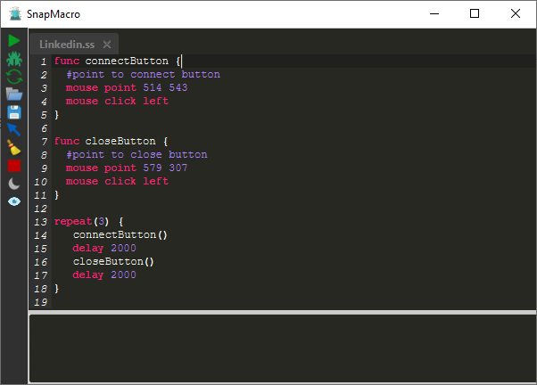
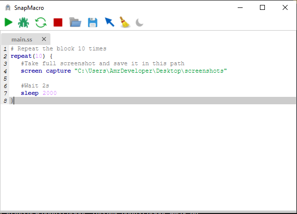

## Snap Macro 1.0.0

Free and open source Cross-platform bot creator with a new scripting language called 
snap to interact with mouse, keyboard and screen using snap scripting language 

[](https://sourceforge.net/projects/snapmacro/files/latest/download)
[](https://sourceforge.net/projects/snapmacro/files/latest/download)

Snap language has many features to make it easy to implement your bot
  
  

### Features:
- variables,
- conditions,
- flow conditions like if, while loop, repeat loop
- sleep, exit statements

### Editor shortcuts
- `F1`    to change editor theme dark/light
- `F5`    to run snap script
- `F6`    to run snap script in debugging mode
- `F7`    to restart the execution
- `F8`    to stop running snap script
- `F9`    to load new snap script file in new tab
- `F10`   to save current snap script file
- `F11`   Show/Stop the X and Y values in the current cursor position
- `F12`   Show/Stop the pixel value in the current cursor position
- `F13`   Clear the debugging info area  

For examples take a look at example directory

### How to use?
To run SnapMacro Jar you need to install JDK 8
Then You can download SnapMacro from [Here](https://github.com/AmrDeveloper/SnapMacro/raw/master/jar/SnapMacro.jar)

### Instructions

#### Mouse

##### Perform right or left mouse click
`
mouse click (left | right)
`

##### Move mouse cursor to x, y position
`
mouse point x y
`

#### Mouse wheel to control wheel and scroll down or up
```
mouse wheel 10
mouse wheel -10
```

#### Keyboard

#### Keyboard press key
`
keyboard press key
`

#### Keyboard keys
```
F1 to F11
F12 to F24
DIGIT_0 to DIGIT_9
CHAR_A to CHAR_Z
```

#### Screen to take screenshot and store it in path
`
screen capture "C:\Users\AmrDeveloper\Desktop\screenshots"
`

##### Sleep execution s milliseconds
`
delay s
`

#### Variables assign and reassign
`
var x = 10
x = x + 1
`

#### If to execute the body if the condition is true
```
if(condition) {

}
```

##### Execute the body statements n times
```
repeat(n) {
   
}
```

##### Execute the body statements while the condition is true
```
while(condition) {
   
}
```

##### Function declaration to make easy to call or repeat instructions
```
func name {

}
```

##### Function call to execute function instructions
`
name()
`

#### Boolean values
```
true
false
```

#### Math Operations
```
+ / - *
```

#### Bitwise Operations
```
x and y
x or y
x xor y
```

#### Pixel Color to get color of current pointer position
```
mouse point 100 100
var color = pixelColor()
if(color == "0xffffff") {

}
```

#### Restart the execution to start from first line
```
restart
```

#### Exit the execution to stop the script
```
exit
```

#### Comments to make your script more readable
```
# .....
```
