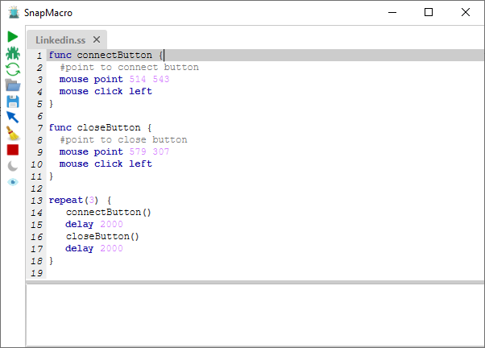

****## Snap Macro 1.0.0

Free and open source Cross-platform bot creator with a new scripting language called 
snap to interact with mouse, keyboard and screen using snap scripting language 

Snap language has many features to make it easy to implement your bot
  
  

### Features:
- variables,
- conditions,
- flow conditions like if, while loop, repeat loop
- sleep, exit statements

For examples take a look at example directory

### How to use?
To run SnapMacro Jar you need to install JDK 8
Then You can download SnapMacro from [Here](https://github.com/AmrDeveloper/SnapMacro/raw/master/jar/SnapMacro.jar)

### Instructions

#### Perform right or left mouse click
`
mouse click (left | right)
`

#### Move mouse cursor to x, y position
`
mouse point x y
`

#### Sleep execution s milliseconds
`
sleep s
`

#### Execute the body statements n times
```
repeat(n) {
   
}
```

#### Function decleration to make easy to call or repeat instructions
```
function name {

}
```
#### Function call to execute function instructions
`
name()
`
#### Comments used to make your script more readable
`
#todo
`
